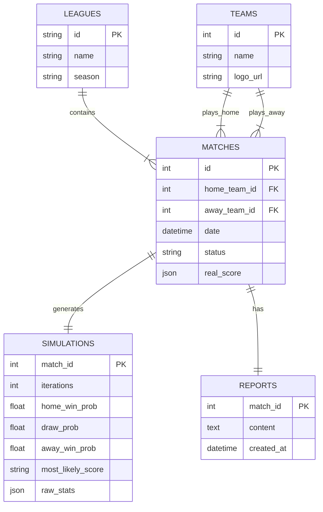

# Football Oracle - Architecture

**Versión:** 1.0  
**Tipo:** Event-Driven Microservices Architecture (EDA)  
**Repositorio:** Monorepo  
**Fecha:** 22 Enero 2026

### Deuda Técnica (TODOs)

| Sección | TODOs | Estado |
|---------|-------|--------|
| 7. Consistencia de Datos | 3 | Pendiente |
| 8. Robustez y Tolerancia a Fallos | 4 | Pendiente |
| 9. Seguridad | 4 | Pendiente |
| 10. Observabilidad | 3 | Pendiente |
| 11. Gestión de Base de Datos | 2 | Pendiente |
| **Total** | **16** | - |

---

## 1. Visión General del Producto

Plataforma de análisis deportivo avanzado que combina ingeniería de datos, estadística probabilística (Monte Carlo) e Inteligencia Artificial Generativa. El sistema permite ingerir calendarios de ligas reales, simular partidos 100.000 veces basándose en métricas de xG (Goles Esperados) y generar crónicas periodísticas automáticas comparando la realidad vs. la probabilidad.

---

## 2. Arquitectura de Alto Nivel

El sistema sigue un patrón de **Microservicios Asíncronos** orquestados por eventos. Se prioriza el desacoplamiento para permitir escalar los procesos de scraping (lentos) y simulación (intensivos en CPU) de forma independiente.

### Componentes Principales

| Componente            | Tecnología             | Responsabilidad Principal                                              |
| :-------------------- | :--------------------- | :--------------------------------------------------------------------- |
| **Frontend App**      | Next.js (React)        | Interfaz de usuario: Dashboard, listados y visualización de reportes.  |
| **API Orchestrator**  | Node.js (TS) / Express | Gateway, gestión de usuarios y control de flujo de peticiones.         |
| **Scraper Worker**    | Python                 | Extracción de datos (ScraperFC/Sofascore). Único componente en Python. |
| **Simulation Engine** | Node.js (TS)           | Motor matemático. Ejecución de algoritmos Monte Carlo.                 |
| **Journalist Agent**  | Node.js (TS) + Genkit  | Generación de narrativas (NLG) usando LLMs (Gemini/OpenAI).            |
| **Message Broker**    | RabbitMQ               | Bus de eventos para comunicación asíncrona.                            |
| **Persistencia**      | PostgreSQL             | Base de datos relacional principal.                                    |
| **Caché/Estado**      | Redis                  | Caché de respuestas y estado de trabajos en tiempo real.               |

---

## 3. Catálogo de Servicios y Responsabilidades

### A. Frontend (UI)

- **Stack:** Next.js, TailwindCSS.
- **Funciones:**
  - Visualización de Ligas y Temporadas.
  - _Sync Trigger:_ Botón para sincronizar calendarios.
  - _Simulation Trigger:_ Botón para iniciar análisis de un partido.
  - Polling/Sockets para actualizar el estado ("Analizando...").

### B. API Orchestrator (Core)

- **Stack:** Node.js, TypeScript.
- **Funciones:**
  - Endpoints REST para el Frontend.
  - Productor de eventos iniciales (`cmd.sync_calendar`, `cmd.analyze_match`).
  - Lectura/Escritura en PostgreSQL.
  - Verificación de caché en Redis antes de iniciar procesos pesados.

### C. Scraper Worker (Python Service)

- **Stack:** Python 3.10+, ScraperFC, Pika (RabbitMQ client).
- **Modos de Operación:**
  1.  **Modo Calendario (Light):** Descarga lista de partidos (IDs, fechas, equipos) sin entrar al detalle.
  2.  **Modo Partido (Heavy):** Entra en un ID específico y extrae el _Shotmap_ (mapa de tiros) y xG.

### D. Simulation Engine (Node Service)

- **Stack:** Node.js, TypeScript.
- **Lógica:**
  - Recibe los datos de tiros (`shot_list`).
  - Ejecuta bucle de 100.000 iteraciones.
  - Calcula: Probabilidades de victoria (Local/Empate/Visitante), Resultado más probable (Moda), Goleadores probables.

### E. Journalist Agent (Genkit Service)

- **Stack:** Node.js, Google Genkit, Zod (validación).
- **Lógica:**
  - Construye un prompt con: Datos Reales + Datos Simulados.
  - Invoca al LLM para generar una crónica estilo "Periodista Deportivo".
  - Devuelve el texto estructurado (Título, Cuerpo, Conclusiones).

---

## 4. Flujo de Datos y Eventos (Event Choreography)

El sistema se mueve mediante mensajes en RabbitMQ.

**1. Flujo de Ingesta de Calendario (Setup)**

1.  **API** publica: `league.sync_requested` `{ league: "LaLiga", year: "23/24" }`
2.  **Python Worker** consume -> Scrapea lista -> Guarda en DB -> Publica `league.synced`.

**2. Flujo de Análisis de Partido (Core)**

1.  **API** recibe petición POST `/simulate/:id`. Publica `match.analysis_requested`.
2.  **Python Worker** consume. Extrae tiros. Publica `match.data_extracted` (payload: JSON shots).
3.  **Simulator** consume. Ejecuta Monte Carlo. Publica `match.simulation_completed` (payload: Stats).
4.  **Journalist** consume. Genera texto. Publica `match.report_ready`.
5.  **API** consume confirmación y notifica al Frontend (o actualiza estado en DB).

---

## 5. Modelo de Datos (PostgreSQL)

Diseño relacional para soportar el catálogo y los análisis.



> **Notas del modelo:**
> - `MATCHES.id`: ID de Sofascore
> - `MATCHES.status`: Valores posibles: `PENDING`, `FINISHED`, `ANALYZED`
> - `MATCHES.real_score`: JSON con formato `{home: 2, away: 1}`
> - `SIMULATIONS.match_id` y `REPORTS.match_id`: FK hacia MATCHES

## 6. Infraestructura y Despliegue

### Entorno Local (Dev) y Produccion (VPS)

Se utiliza Docker Compose para orquestar la infraestructura completa. No se requiere instalacion local de runtimes.

### Estructura del docker-compose.yml

| Servicio           | Puerto        | Descripcion                      |
| :----------------- | :------------ | :------------------------------- |
| `postgres`         | 5432          | Base de datos                    |
| `rabbitmq`         | 5672 / 15672  | Broker de mensajeria             |
| `redis`            | 6379          | Cache temporal                   |
| `app-frontend`     | 3000          | Frontend Next.js                 |
| `service-api`      | 4000          | API Gateway                      |
| `service-scraper`  | -             | Worker (sin puerto expuesto)     |
| `service-simulator`| -             | Worker (sin puerto expuesto)     |
| `service-genkit`   | -             | Worker (sin puerto expuesto)     |

### Repositorio (Monorepo Strategy)

Estructura de carpetas optimizada para VS Code Workspaces:

```
/
├── apps/
│   ├── web/                 # Frontend (Next.js)
│   └── api/                 # API Gateway (Express)
├── services/
│   ├── scraper/             # Python Worker
│   ├── engine/              # Node Simulation Engine
│   └── journalist/          # Genkit NLG Service
├── packages/
│   ├── database/            # Prisma Schema & Client
│   └── types/               # Shared TS Interfaces
└── docker-compose.yml
```

---

## 7. Consistencia de Datos

<!-- TODO_COUNT: 3 -->

> **TODO:** Definir estrategia para transacciones distribuidas.
> - ¿Outbox pattern para garantizar que DB write + evento se publiquen atómicamente?
> - ¿Saga pattern para flujos multi-servicio?

> **TODO:** Definir política de idempotencia.
> - ¿Cómo evitar procesar el mismo partido dos veces?
> - ¿Idempotency keys en los eventos?

> **TODO:** Definir estrategia de sincronización de datos.
> - ¿Qué pasa si Sofascore actualiza datos de un partido ya analizado?
> - ¿Re-análisis manual o automático?

---

## 8. Robustez y Tolerancia a Fallos

<!-- TODO_COUNT: 4 -->

> **TODO:** Configurar Dead Letter Queues (DLQ) en RabbitMQ.
> - ¿Cuántos reintentos antes de enviar a DLQ?
> - ¿Alertas cuando hay mensajes en DLQ?

> **TODO:** Definir timeouts y circuit breakers.
> - Scraper: ¿timeout por request a Sofascore?
> - LLM: ¿timeout y fallback si Gemini no responde?

> **TODO:** Definir estrategia de health checks.
> - ¿Liveness vs Readiness probes?
> - ¿Qué servicios deben exponer `/health`?

> **TODO:** Definir comportamiento ante fallos parciales.
> - ¿Qué pasa si el Journalist falla pero la simulación ya se completó?
> - ¿Reintentar solo el paso fallido?

---

## 9. Seguridad

<!-- TODO_COUNT: 4 -->

> **TODO:** Definir autenticación y autorización.
> - ¿JWT? ¿Sessions? ¿OAuth?
> - ¿Roles de usuario o acceso único?

> **TODO:** Definir gestión de secrets.
> - API keys de LLMs (Gemini/OpenAI)
> - Credenciales de base de datos
> - ¿Docker secrets? ¿Vault? ¿Variables de entorno?

> **TODO:** Definir rate limiting.
> - ¿Límites en API Gateway?
> - ¿Límites hacia Sofascore para evitar bloqueos?

> **TODO:** Definir política de validación de inputs.
> - ¿Sanitización de IDs de partidos?
> - ¿Validación de payloads en eventos?

---

## 10. Observabilidad

<!-- TODO_COUNT: 3 -->

> **TODO:** Definir estrategia de logging.
> - ¿Formato estructurado (JSON)?
> - ¿Logging centralizado (ELK, Loki)?

> **TODO:** Definir trazabilidad de eventos.
> - ¿Correlation ID a través de todo el flujo?
> - ¿Cómo rastrear un análisis desde request hasta report?

> **TODO:** Definir métricas y alertas.
> - ¿Prometheus + Grafana?
> - ¿Qué métricas son críticas? (latencia, errores, cola de mensajes)

---

## 11. Gestión de Base de Datos

<!-- TODO_COUNT: 2 -->

> **TODO:** Definir estrategia de inicialización de BD.
> - Actualmente `POSTGRES_DB=football` en docker-compose solo crea la BD en el contenedor
> - Los servicios fallan si la BD no existe o el schema no está creado
> - ¿Script de inicialización? ¿Init container? ¿Healthcheck con retry?
> - Ver ADR-0006 para decisión sobre herramientas

> **TODO:** Definir estrategia de migraciones.
> - ¿Prisma Migrate? ¿Drizzle Kit? ¿SQL puro con herramienta tipo golang-migrate?
> - ¿Migraciones automáticas en startup vs CI/CD controlado?
> - ¿Rollback strategy?

---

## 12. Notas de Implementacion para IA (Genkit)

- **Modelo:** Usar modelos eficientes en costes (`gemini-1.5-flash` o `gpt-4o-mini`).
- **Prompting:** Usar tecnica Chain-of-Thought en el prompt: "Analiza primero los datos de xG, luego compara con el resultado real, y finalmente escribe la crónica".
- **Temperatura:** Ajustar a `0.7` para creatividad periodistica sin alucinar datos numericos.

---
