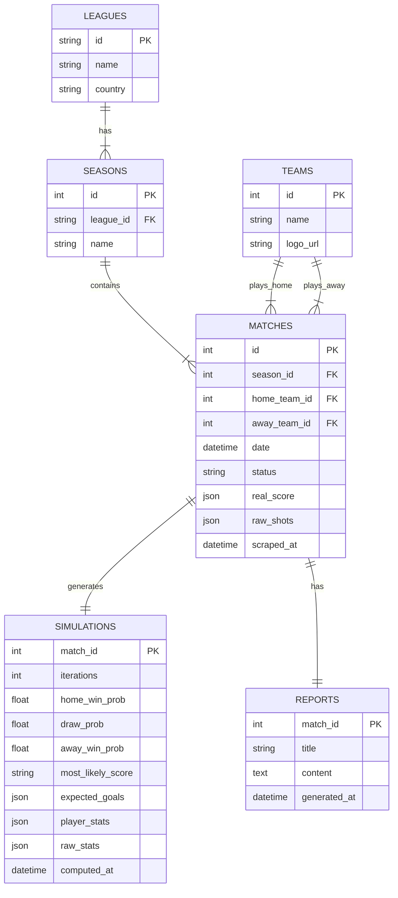

# Football Oracle - Architecture

**Versión:** 1.0  
**Tipo:** Event-Driven Microservices Architecture (EDA)  
**Repositorio:** Monorepo  
**Fecha:** 22 Enero 2026

### Deuda Técnica (TODOs)

| Sección                           | TODOs  | Estado    |
| --------------------------------- | ------ | --------- |
| 7. Consistencia de Datos          | 3      | Pendiente |
| 8. Robustez y Tolerancia a Fallos | 4      | Pendiente |
| 9. Seguridad                      | 4      | Pendiente |
| 10. Observabilidad                | 3      | Pendiente |
| 11. Gestión de Base de Datos      | 2      | Pendiente |
| **Total**                         | **16** | -         |

---

## 1. Visión General del Producto

Plataforma de análisis deportivo avanzado que combina ingeniería de datos, estadística probabilística (Monte Carlo) e Inteligencia Artificial Generativa. El sistema permite ingerir calendarios de ligas reales, simular partidos 100.000 veces basándose en métricas de xG (Goles Esperados) y generar crónicas periodísticas automáticas comparando la realidad vs. la probabilidad.

---

## 2. Arquitectura de Alto Nivel

El sistema sigue un patrón de **Microservicios Asíncronos** orquestados por eventos. Se prioriza el desacoplamiento para permitir escalar los procesos de scraping (lentos) y simulación (intensivos en CPU) de forma independiente.

### Componentes Principales

| Componente            | Tecnología             | Responsabilidad Principal                                                     |
| :-------------------- | :--------------------- | :---------------------------------------------------------------------------- |
| **Frontend App**      | Next.js (React)        | Interfaz de usuario: Dashboard, listados y visualización de reportes.         |
| **API Orchestrator**  | Node.js (TS) / Express | Gateway/BFF. Orquestación de peticiones y autenticación.                      |
| **Data Registry**     | Node.js (TS) / Prisma  | **Nuevo:** Servicio central de persistencia y caché (Single Source of Truth). |
| **Scraper Worker**    | Python                 | Extracción de datos (ScraperFC/Sofascore). Único componente en Python.        |
| **Simulation Engine** | Node.js (TS)           | Motor matemático. Ejecución de algoritmos Monte Carlo.                        |
| **Journalist Agent**  | Node.js (TS) + Genkit  | Generación de narrativas (NLG) usando LLMs (Gemini/OpenAI).                   |
| **Message Broker**    | Apache Kafka (KRaft)   | Bus de eventos para comunicación asíncrona.                                   |
| **Persistencia**      | PostgreSQL + Redis     | Almacenamiento relacional y caché de alto rendimiento.                        |

---

## 3. Catálogo de Servicios y Responsabilidades

### A. Frontend (UI)

- **Stack:** Next.js, TailwindCSS.
- **Funciones:**
  - Visualización de Ligas y Temporadas.
  - _Sync Trigger:_ Botón para sincronizar calendarios.
  - _Simulation Trigger:_ Botón para iniciar análisis de un partido.
  - Polling/Sockets para actualizar el estado ("Analizando...").

### B. API Orchestrator (Core)

- **Stack:** Node.js, TypeScript.
- **Funciones:**
  - Endpoints REST para el Frontend.
  - Productor de eventos iniciales (`match.analysis.requested`).
  - Actúa como BFF (Backend for Frontend), agregando datos del Data Registry.
  - Gestión de sesiones y seguridad.

### C. Data Registry (Persistence)

- **Stack:** Node.js, TypeScript, Prisma/Drizzle.
- **Funciones:**
  - Single Source of Truth para todas las entidades (Matches, Leagues, Sims, Reports).
  - Implementación del **Transactional Outbox Pattern** para Kafka.
  - Abstracción de PostgreSQL y Redis.
  - API interna para el Scraper de Python.
- **Diseño Detallado:** Ver [docs/services/data-registry.md](docs/services/data-registry.md).

- **Stack:** Python 3.10+, ScraperFC, confluent-kafka.
- **Modos de Operación:**
  1.  **Modo Calendario (Light):** Descarga lista de partidos (IDs, fechas, equipos) sin entrar al detalle.
  2.  **Modo Partido (Heavy):** Entra en un ID específico y extrae el _Shotmap_ (mapa de tiros) y xG.

### E. Simulation Engine (Node Service)

- **Stack:** Node.js, TypeScript.
- **Lógica:**
  - Recibe los datos de tiros (`shot_list`).
  - Ejecuta bucle de 100.000 iteraciones.
  - Calcula: Probabilidades de victoria (Local/Empate/Visitante), Resultado más probable (Moda), Goleadores probables.

### F. Journalist Agent (Genkit Service)

- **Stack:** Node.js, Google Genkit, Zod (validación).
- **Lógica:**
  - Construye un prompt con: Datos Reales + Datos Simulados.
  - Invoca al LLM para generar una crónica estilo "Periodista Deportivo".
  - Devuelve el texto estructurado (Título, Cuerpo, Conclusiones).

---

## 4. Flujo de Datos y Eventos (Event Choreography)

El sistema se mueve mediante mensajes en Kafka.

**1. Flujo de Ingesta de Calendario (Setup)**

1.  **API** publica: `league.sync_requested` `{ league: "LaLiga", year: "23/24" }`
2.  **Python Worker** consume -> Scrapea lista -> Guarda en DB -> Publica `league.synced`.

**2. Flujo de Análisis de Partido (Core)**

1.  **API** recibe petición POST `/simulate/:id`. Publica `match.analysis_requested`.
2.  **Python Worker** consume. Extrae tiros. Publica `match.data_extracted` (payload: JSON shots).
3.  **Simulator** consume. Ejecuta Monte Carlo. Publica `match.simulation_completed` (payload: Stats).
4.  **Journalist** consume. Genera texto. Publica `match.report_ready`.
5.  **API** consume confirmación y notifica al Frontend (o actualiza estado en DB).

---

## 5. Modelo de Datos y Estrategia de Persistencia

El sistema utiliza un modelo relacional en **PostgreSQL** como fuente de verdad y **Redis** como capa de aceleración y control de concurrencia.

### A. Modelo Relacional (PostgreSQL)

El modelo está diseñado para soportar no solo el análisis individual, sino también proyecciones estadísticas a largo plazo (como simulación de ligas completas o comparación de xPoints).



> **Notas sobre Simulaciones:**
>
> - `player_stats`: Almacena un mapa de `playerId -> { expectedGoals, simsWithGoalCount }` para alimentar crónicas detalladas.
> - `raw_stats`: Contiene la distribución de frecuencia de todos los resultados (ej: `{ "2-1": 15000, "1-1": 12000, ... }`) para generar mapas de calor en el frontend.
> - Los porcentajes de victoria (`home_win_prob`, etc.) permiten calcular los "Puntos Esperados" (xP) y compararlos con la realidad de la tabla clasificatoria.

### B. Estrategia de Caché y Concurrencia (Redis)

Redis se utiliza para optimizar el rendimiento y evitar trabajos duplicados ("Thundering Herd").

| Tipo de Datos        | Estructura                      | TTL   | Razón                                                                           |
| :------------------- | :------------------------------ | :---- | :------------------------------------------------------------------------------ |
| **Locks de Proceso** | `lock:match:scrapp:{id}`        | 5 min | Evita que dos instancias del Scraper procesen el mismo partido simultáneamente. |
| **Match Summary**    | `cache:match:view:{id}`         | 24h   | Agregación de Metadatos + Simulación + Reporte para el Frontend.                |
| **Catalog Cache**    | `cache:league:{id}:season:{id}` | 1h    | Listado de partidos de una temporada para navegación rápida.                    |

### C. Almacenamiento de Eventos (Transactional Outbox)

Para garantizar que cada cambio de estado en la base de datos se notifique a Kafka, el **Data Registry** implementa una tabla de `OUTBOX`:

1. El servicio realiza el cambio en `MATCHES` y escribe el evento en la tabla `OUTBOX` dentro de la misma transacción.
2. Un proceso secundario (o un trigger de Prisma/CDC) lee de `OUTBOX` y publica en Kafka.
3. Esto garantiza **consistencia eventual** incluso si Kafka está temporalmente caído.

## 6. Infraestructura y Despliegue

### Entorno Local (Dev) y Produccion (VPS)

Se utiliza Docker Compose para orquestar la infraestructura completa. No se requiere instalacion local de runtimes.

### Estructura del docker-compose.yml

| Servicio            | Puerto | Descripcion                  |
| :------------------ | :----- | :--------------------------- |
| `postgres`          | 5432   | Base de datos                |
| `kafka`             | 9092   | Bus de mensajería (KRaft)    |
| `redis`             | 6379   | Cache temporal               |
| `app-frontend`      | 3000   | Frontend Next.js             |
| `service-api`       | 4000   | API Gateway                  |
| `service-scraper`   | -      | Worker (sin puerto expuesto) |
| `service-simulator` | -      | Worker (sin puerto expuesto) |
| `service-genkit`    | -      | Worker (sin puerto expuesto) |

### Repositorio (Monorepo Strategy)

Estructura de carpetas optimizada para VS Code Workspaces:

```
/
├── apps/
│   ├── web/                 # Frontend (Next.js)
│   └── api/                 # API Gateway (Express)
├── services/
│   ├── data-registry/       # Persistence Service (Node.js)
│   ├── scraper/             # Python Worker
│   ├── engine/              # Node Simulation Engine
│   └── journalist/          # Genkit NLG Service
├── packages/
│   ├── database/            # Prisma Schema & Client
│   └── types/               # Shared TS Interfaces
└── docker-compose.yml
```

---

## 7. Consistencia de Datos

<!-- TODO_COUNT: 3 -->

> **TODO:** Definir estrategia para transacciones distribuidas.
>
> - ¿Outbox pattern para garantizar que DB write + evento se publiquen atómicamente?
> - ¿Saga pattern para flujos multi-servicio?

> **TODO:** Definir política de idempotencia.
>
> - ¿Cómo evitar procesar el mismo partido dos veces?
> - ¿Idempotency keys en los eventos?

> **TODO:** Definir estrategia de sincronización de datos.
>
> - ¿Qué pasa si Sofascore actualiza datos de un partido ya analizado?
> - ¿Re-análisis manual o automático?

---

## 8. Robustez y Tolerancia a Fallos

<!-- TODO_COUNT: 4 -->

> **TODO:** Configurar Dead Letter Queues (DLQ) o Retry Topics en Kafka.
>
> - ¿Cuántos reintentos antes de enviar a DLQ?
> - ¿Alertas cuando hay mensajes en DLQ?

> **TODO:** Definir timeouts y circuit breakers.
>
> - Scraper: ¿timeout por request a Sofascore?
> - LLM: ¿timeout y fallback si Gemini no responde?

> **TODO:** Definir estrategia de health checks.
>
> - ¿Liveness vs Readiness probes?
> - ¿Qué servicios deben exponer `/health`?

> **TODO:** Definir comportamiento ante fallos parciales.
>
> - ¿Qué pasa si el Journalist falla pero la simulación ya se completó?
> - ¿Reintentar solo el paso fallido?

---

## 9. Seguridad

<!-- TODO_COUNT: 4 -->

> **TODO:** Definir autenticación y autorización.
>
> - ¿JWT? ¿Sessions? ¿OAuth?
> - ¿Roles de usuario o acceso único?

> **TODO:** Definir gestión de secrets.
>
> - API keys de LLMs (Gemini/OpenAI)
> - Credenciales de base de datos
> - ¿Docker secrets? ¿Vault? ¿Variables de entorno?

> **TODO:** Definir rate limiting.
>
> - ¿Límites en API Gateway?
> - ¿Límites hacia Sofascore para evitar bloqueos?

> **TODO:** Definir política de validación de inputs.
>
> - ¿Sanitización de IDs de partidos?
> - ¿Validación de payloads en eventos?

---

## 10. Observabilidad

<!-- TODO_COUNT: 3 -->

> **TODO:** Definir estrategia de logging.
>
> - ¿Formato estructurado (JSON)?
> - ¿Logging centralizado (ELK, Loki)?

> **TODO:** Definir trazabilidad de eventos.
>
> - ¿Correlation ID a través de todo el flujo?
> - ¿Cómo rastrear un análisis desde request hasta report?

> **TODO:** Definir métricas y alertas.
>
> - ¿Prometheus + Grafana?
> - ¿Qué métricas son críticas? (latencia, errores, cola de mensajes)

---

## 11. Gestión de Base de Datos

<!-- TODO_COUNT: 1 -->

> **Decisión:** Se ha centralizado la gestión de la BD en un servicio Node.js denominado **Data Registry** ([ADR-0011](docs/adr/0011-arquitectura-servicio-persistencia.md)). Esto resuelve la duplicidad de lógica en lenguajes heterogéneos.

> **TODO:** Implementar el schema centralizado usando Prisma/Drizzle en `services/data-registry` y sincronizarlo con el `docker-compose.yml`.

---

## 12. Notas de Implementacion para IA (Genkit)

- **Modelo:** Usar modelos eficientes en costes (`gemini-1.5-flash` o `gpt-4o-mini`).
- **Prompting:** Usar tecnica Chain-of-Thought en el prompt: "Analiza primero los datos de xG, luego compara con el resultado real, y finalmente escribe la crónica".
- **Temperatura:** Ajustar a `0.7` para creatividad periodistica sin alucinar datos numericos.

---
